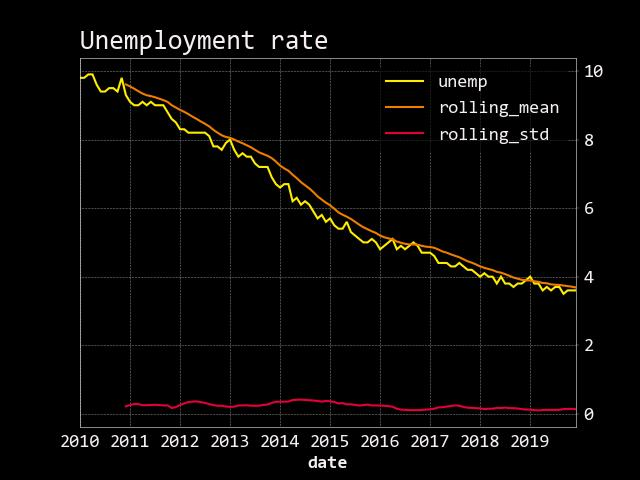
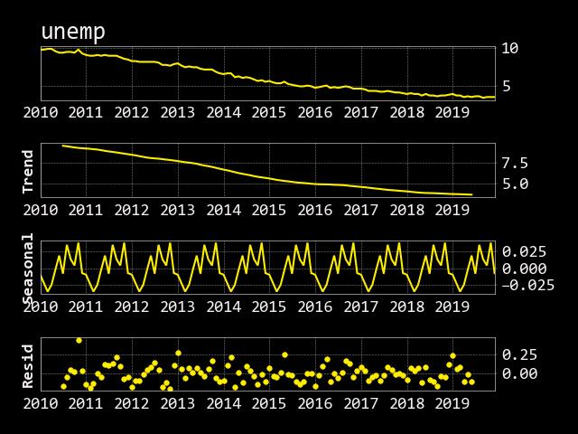
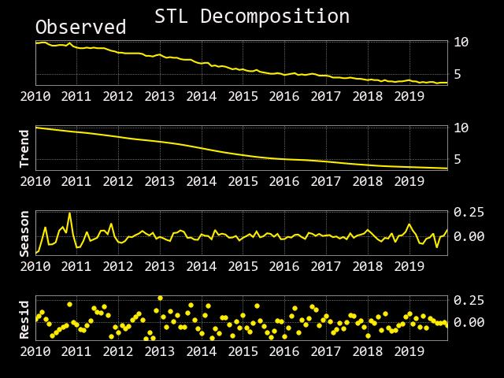

# Decompose time series of US unemployment data.

Time series decomposition is breaking down a single time series into different parts. Each part represents a pattern that you can try to model and predict. The patterns usually fall into three categories: trend, seasonality, and noise.

Time series decomposition models are additive, multiplicative, or some combination of both. Additive models are used when the trend is not proportional to the level of the time series. Multiplicative models are used when the trend is proportional.

Decomposition is used by quants to forecast time series. For example, decomposing and forecasting macroeconomic time series helps portfolio managers and macro investors identify trends, rebalance portfolios to take advantage of seasonality, and manage risk.

### Time series decomposition helps quants understand the data

Most financial data is non-stationary so predictive models fit badly. Decomposing can help you remove components to make the time series more stationary. Once the stationary components are modeled, you can reassemble the time series.

Unfortunately, most people forget about decomposition as a way to predict time series. Especially when it comes to macroeconomic data.

---

Key Takeaways:

- Get US unemployment data for free

- Decompose the time series with an additive model

- Decompose the time series with LOESS

---

## Step 1: Import the libraries 

Pandas for data manipulation,

statsmodels for time series analysis,

OpenBB SDK for data.

matplotlib for data visualization

---

## Step 2: Get the Data

Use the OpenBB SDK to get the unemployment data.

---

## Step 3: Decompose the time series for seasonality and trend

Visualize the data through time by plotting the time series.

There’s a clear downward trend in the unemployment rate. There also appears to be some consistent spikes. 

Time series decomposition should pick up these patterns.

Run the model and plot the results.

The code extracted the trend, seasonal, and noise components from the time series. 

Take a look at the noise component and inspect if it looks random. 
If there was a strong pattern, it would tell you the time series is serially auto-correlated and the model fit is suspect.

The additive model is basic and comes with caveats. 
First, there are missing data points at the beginning and end because the algorithm uses a moving average. The model assumes that there is the same seasonal pattern every year. 

Finally, the model is not robust to outliers.

Time to try a more robust method.

---

## Step 4: Decompose the time series with LOESS
Seasonal-trend decomposition (STL) uses locally estimated scatterplot smoothing (LOESS) to extract seasonality and trend from a time series. It improves on the basic additive model by handling any kind of seasonality and being more robust to outliers.

Run the model and plot the results.

The results are like the additive model. But, there are no missing values, and the seasonality component changes slowly over time.

Here we decomposed a time series of US unemployment data. 
Now you can inspect the trend and seasonality of a data series. 
By inspecting the noise component, you have an idea of the “goodness of fit” of the model, too. 
By decomposing time series you can model each component and better predict the combined time series.

---

